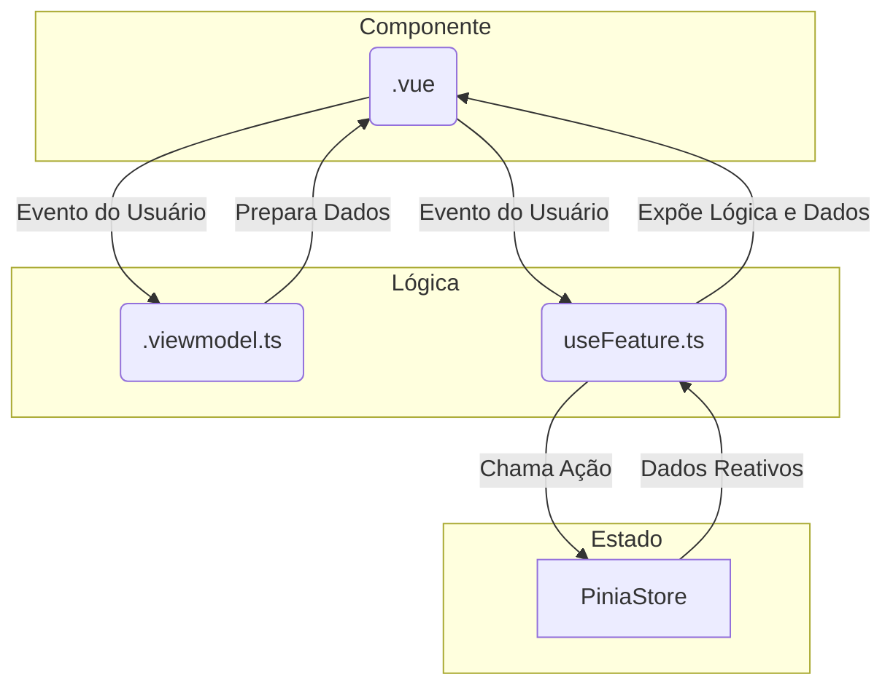

# Todo-List: Documentação Técnica

## 1. Visão Geral da Arquitetura

Este projeto adota uma arquitetura híbrida e bem definida, combinando uma estrutura **Modular** no nível da aplicação com um padrão que se assemelha ao **Model-View-ViewModel (MVVM)** no nível dos componentes.

### Padrão Arquitetural

1.  **Arquitetura Modular**: O código-fonte (`src`) é organizado em dois diretórios principais, promovendo uma forte separação de conceitos (Separation of Concerns):
    *   `src/modules`: Contém os domínios de negócio ou *features* da aplicação (ex: `tasks`). Cada módulo é projetado para ser autocontido, com suas próprias views, view-models e modelos de dados.
    *   `src/_shared`: Agrupa códigos reutilizáveis e transversais, como componentes de UI genéricos (Botão, Input), stores globais (Pinia), composables, layouts e constantes.

2.  **Padrão MVVM para Componentes**: Cada componente, especialmente os compartilhados, segue uma variação do padrão MVVM, dividindo suas responsabilidades em três arquivos distintos:
    *   `*.vue` (View): Responsável exclusivamente pela estrutura (template HTML) e pelo estilo. Ele recebe um "view model" e renderiza a UI com base nos dados e funções expostos por ele.
    *   `*.viewmodel.ts` (ViewModel): Uma função que contém toda a lógica, estado, propriedades computadas e manipuladores de eventos do componente. Ele age como uma ponte, preparando os dados do Model para a View e processando as interações do usuário.
    *   `*.model.ts` (Model): Define as "interfaces de contrato" do componente, incluindo os tipos das `props`, `emits` e o objeto retornado pelo ViewModel. Garante a segurança de tipos e a clareza da API do componente.

### Fluxo de Dados Principal

O fluxo de dados é reativo e unidirecional, orquestrado pelo Vue 3 e Pinia:

1.  **Estado Centralizado**: O estado global ou compartilhado entre features (como o estado de notificações `toast` ou a lista de tarefas) é gerenciado pelo **Pinia**. As Stores são a única fonte de verdade para esses dados.
2.  **Lógica da Feature**: As `views` de um módulo (ex: `TasksView.vue`) utilizam **Composables** do Vue 3 (ex: `useTasksView.ts`) para encapsular a lógica de negócio daquela tela.
3.  **Conexão com o Estado**: Esses composables se conectam às stores do Pinia para obter dados (`storeToRefs`) ou para despachar ações (`removeTask`).
4.  **Renderização na View**: A View (componente `.vue`) consome os dados reativos e as funções expostas pelo seu composable ou view-model e renderiza a interface.
5.  **Interação do Usuário**: Eventos do usuário na View (ex: `@click`) acionam funções no ViewModel/Composable, que por sua vez podem invocar ações nas stores do Pinia, reiniciando o ciclo de forma reativa.



## 2. Stack Tecnológica

| Tecnologia         | Versão (aprox.) | Justificativa de Uso                                                                                             |
| ------------------ | --------------- | ---------------------------------------------------------------------------------------------------------------- |
| **Vue.js**         | `^3.5`          | Framework progressivo para a construção de interfaces reativas. A **Composition API** é usada para organizar a lógica. |
| **Vite**           | `^7.1`          | Ferramenta de build extremamente rápida que oferece uma experiência de desenvolvimento superior (HMR, build otimizado). |
| **TypeScript**     | `~5.9`          | Garante a segurança de tipos em todo o projeto, resultando em um código mais robusto, legível e fácil de manter.     |
| **Pinia**          | `^3.0`          | Biblioteca oficial de gerenciamento de estado para o Vue. Escolhida por sua simplicidade, API intuitiva e integração total com TypeScript. |
| **Vue Router**     | `^4.6`          | Biblioteca oficial para gerenciamento de rotas no lado do cliente (SPA).                                         |
| **TailwindCSS**    | `^4.1`          | Framework CSS utility-first que permite a criação de designs customizados de forma rápida e consistente.         |
| **Vitest**         | `^3.2`          | Framework de testes unitários rápido e configurado para trabalhar com Vite.                                      |
| **Playwright**     | `^1.56`         | Framework para testes end-to-end (E2E) que permite testar a aplicação em múltiplos navegadores.                  |
| **ESLint**         | `^9.39`         | Ferramenta para análise estática de código que ajuda a encontrar problemas e a manter um padrão de codificação.    |

## 3. Estrutura de Pastas e Módulos

A estrutura foi desenhada para ser escalável e organizada, separando o código por responsabilidade de domínio e reuso.

```
src/
├── _shared/         # Código reutilizável em toda a aplicação
│   ├── components/  # Componentes de UI "burros" e genéricos (Button, Input)
│   ├── composables/ # Funções da Composition API reutilizáveis (ex: useToast)
│   ├── consts/      # Constantes globais
│   ├── interfaces/  # Tipos e interfaces globais
│   ├── layouts/     # Componentes estruturais de páginas (ex: MainLayout)
│   ├── stores/      # Stores globais do Pinia (ex: ToastStore, GlobalStore)
│   └── utils/       # Funções utilitárias puras
│
├── app/             # Núcleo da aplicação e inicialização
│   ├── assets/      # CSS global, fontes, etc.
│   ├── router/      # Configuração do Vue Router
│   ├── App.vue      # Componente raiz da aplicação
│   └── main.ts      # Ponto de entrada (cria a instância do Vue, registra plugins)
│
└── modules/         # Features/domínios de negócio da aplicação
    └── tasks/       # Módulo de "Tarefas"
        ├── models/         # Modelos de dados específicos do módulo
        ├── view-models/    # Lógica de apresentação (composables de features)
        └── views/          # Componentes de página (Views) e seus sub-componentes
```

## 4. Características e Padrões de Código

Além da arquitetura principal, o projeto segue padrões de código limpo para garantir a manutenibilidade.

*   **Padrão ViewModel em Componentes**: Como descrito na seção de arquitetura, a separação em `*.vue`, `*.viewmodel.ts` e `*.model.ts` é o padrão principal para componentes reutilizáveis. Isso força a lógica a ser desacoplada da apresentação, facilitando testes e reuso.
*   **Uso de Composables para Lógica de View**: Para as views principais de cada módulo, a lógica é extraída para um *composable* (ex: `useTasksView`), que centraliza a interação com as stores e prepara os dados para a view.
*   **Nomenclatura Consistente**: Os arquivos são nomeados de forma clara e previsível, indicando sua responsabilidade (ex: `TasksView.vue`, `useTasksView.ts`, `GlobalStore.ts`).
*   **Responsabilidade Única (Single Responsibility Principle)**:
    *   Componentes são pequenos e focados em uma única tarefa (ex: `TaskItem`, `TaskFormModal`).
    *   Stores do Pinia gerenciam fatias específicas do estado.
    *   Funções utilitárias são puras e realizam apenas uma operação.
*   **Segurança de Tipos com TypeScript**: O uso de `interfaces` e `types` é mandatório para props, stores, e comunicação entre as camadas, prevenindo uma classe inteira de bugs em tempo de desenvolvimento.

## 5. Guia de Instalação e Execução

Para configurar e rodar o projeto localmente, siga os passos abaixo. O gerenciador de pacotes utilizado é o **pnpm**.

1.  **Instalar Dependências**:
    ```bash
    pnpm install
    ```

2.  **Executar em Modo de Desenvolvimento**:
    Inicia o servidor de desenvolvimento com Hot-Module Replacement (HMR).
    ```bash
    pnpm dev
    ```

3.  **Compilar para Produção**:
    Gera a versão otimizada e minificada do projeto no diretório `dist/`.
    ```bash
    pnpm build
    ```

4.  **Executar Testes Unitários**:
    ```bash
    pnpm test:unit
    ```

5.  **Executar Testes End-to-End**:
    ```bash
    pnpm test:e2e
    ```

6.  **Executar Linter**:
    Verifica a consistência e qualidade do código.
    ```bash
    pnpm lint
    ```
